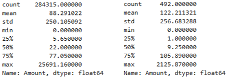
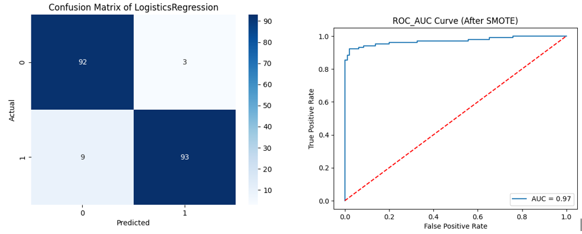

# **Credit Card Fraud Detection Project**
 

## **Objectives**
This repository contains a machine learning project aimed at addressing the issue of credit card fraud detection. With the rising occurrences of fraudulent transactions, our objective is to build an efficient predictive model to detect and prevent fraudulent transactions in real-time.

- Develop and implement a machine learning model for early fraud detection.
- Achieve real-time fraud prediction to enable swift intervention.
- Enhance the bank's ability to prevent fraudulent transactions, safeguarding customers' finances.

## Table of Content
1. Introduction
2. Business Problem
3. Executive Summary
4. Dataset Overview
5. Workflow Architecture
6. EDA
7. Machine Learning
8. Model Evaluation
9. Deployment / Serialization
10. Repository Structure
11. How to Run
12. Conclusion
13. Future Improvements
14. Author

## **Architecture Diagram**
**Raw Data -> EDA -> SMOTE -> Train/Test Split -> Logistic Regression -> Evaluation -> Serialization**

## **Introduction**
Every individual exhibits a unique, baseline behavioral pattern. However, when anomalies in financial transactions are left unaddressed or poorly managed, fraudulent activities emerge, disrupting the integrity of the financial ecosystem. 

## 🌟 **Executive Summary**
This project builds a machine learning pipeline to detect fraudulent credit card transactions using SMOTE and Logistic Regression on a highly imbalanced dataset.

## 💼 **Business Problem & Data Challenge**
Fraudulent transactions cause financial losses and customer distrust. Fraud cases are extremely rare (0.17%), making detection highly challenging.
**Goal:** maximize fraud detection while minimizing false alarms.
- **Fraud Mitigation Rate (91%):** Out of all fraudulent attempts, the model successfully intercepts 91%, saving the business from substantial direct financial losses.
- **High Precision (95%):** helps reduce unnecessary fraud alerts for legitimate customers.
- **High Decision Robustness (0.97 AUC):** Demonstrates near-perfect diagnostic capability, allowing _risk-management teams_ to automate the fraud filter with maximum confidence.

## **Dataset Overview**
-**Source:** Kaggle dataset link [https://www.kaggle.com/datasets/mlg-ulb/creditcard] The dataset used for this project consists of a binary classification system:
- **'0'** denotes legitimate transactions		**284315 ⤬ 31**
- **'1'** represents fraudulent transactions	      **492 ⤬ 31** imbalance ratio
- **Records:** 284807 ⤬ 31
- **Features:** Time, V1, V2, to V 28, Amount, Class 

## 🛠️ **Technical Workflow & Methodology**
1. **Exploratory Data Analysis (EDA):** Identified strong analytical signals from latent features (`V1` to `V28` derived via PCA) to establish precise decision boundaries.
2. **Advanced Data Resampling (SMOTE):** Generated synthetic data points for the minority fraud class (`Counter({1: 492, 0: 492})`), preventing information loss typically caused by under-sampling.
3. **Model Training & Architecture:** Deployed a regularized **Logistic Regression** model optimized for high-volume, low-latency production environments.

**1. Fraud vs Non-Fraud Distribution (Core Challenge of Project)**		

``` python 
data['Class'].value_counts()
```
| **Class** |	**Count** |
|-------|-------|
| Legit (0) |	284,315 |
| Fraud (1) |	    492 |

### **Key Finding**
- Fraud transactions account for only 0.17% of total records.
### **Business Impact**
- Extreme imbalance makes fraud detection difficult.- Accuracy alone becomes misleading.

**2. Transaction Amount Distribution**		
```python 
legit.Amount.describe()
 fraud.Amount.describe()
```	
 
 

**Key Finding**
**Legit Mean Amount:** 88
**Fraud Mean Amount:** 122
- Fraud transactions show unusual high-value spikes.
Insight
- Fraudulent behavior deviates from normal customer patterns.

**3. Time-based Fraud Pattern**		

``` python 
new_data.groupby('Class').mean()
```
### **Key Finding**
Fraudulent activity appears concentrated during specific transaction periods.
**Legit Mean Amount:** 90
**Fraud Mean Amount:** 122
- Legit transactions show slightly high.

### **Insights**
Fraud behavior is not randomly distributed over time and may follow identifiable operational patterns.

### **Storytelling**
Among hundreds of thousands of legitimate purchases, only a tiny fraction are fraudulent.
Without proper balancing techniques, a machine learning model may simply learn to classify almost everything as legitimate.

### **Business Impact**
Banks can strengthen designed as a foundation for future real-time fraud monitoring systems during high-risk transaction windows to reduce financial losses. 

## 📊 **Model Performance & Evaluation**

### **Key Metrics**
- **ROC-AUC Score: 0.97** — Strong ability to distinguish fraud from legitimate transactions.
- **Fraud Recall: 91%** — Successfully captures most fraudulent transactions.
- **Precision: 95%** — Maintains very low false-alarm rates.
- **Test Accuracy: 95.4%** — Stable performance across unseen test data.

### **Preprocessing**
Applied SMOTE to balance minority fraud cases before training the Logistic Regression model.

``` python
X = new_data.drop(columns='Class', axis=1)  # axis=1 represnt column
y = new_data['Class']
```

### **Visual Insights**

```python
cm = confusion_matrix(y_test, X_test_prediction)
sns.heatmap(cm, annot=True, fmt='d', cmap='Blues')
```

```python
y_pred_proba =model_smote.predict_proba(X_test)[:,1]

fpr, tpr, thresholds = roc_curve(y_test, y_pred_proba)
auc = roc_auc_score(y_test, y_pred_proba)
```
| Confusion Matrix (Robustness Check) | ROC-AUC Curve (0.97) |
| :---: | :---: |



- The confusion matrix and ROC curve confirm strong fraud detection capability with _low false-positive rates_.

## 🚀 **Serialization & Production Ready**
The trained model was serialized using joblib, enabling reproducible predictions and easier deployment into production environments. 
```python
loaded_model = joblib.load('fraud_detection_model.pkl')

y_pred = loaded_model.predict(X_test)
```
### **Key Findings**
- Before SMOTE, the model showed high precision (0.98) for fraud detection but missed several fraud cases (FN = 9).
- After applying SMOTE, the model achieved a more balanced performance between fraud and non-fraud classes.
- The saved and reloaded model preserved identical performance, confirming pipeline reproducibility.

### **Insights**
- Fraud detection models must prioritize minimizing False Negatives because undetected fraud directly causes financial loss.

### **Business Impact**
- Reduces financial losses caused by undetected fraud. 
- Supports real-time fraud monitoring systems. 
- Improves customer trust through reliable fraud prevention.

## 📁 **Repository Structure**
* `data/` : Sub-sampled data files (Credit Card Fraud Dataset).
* `notebooks/` : End-to-end Python notebooks containing EDA, SMOTE implementation, and training loops.
* `models/` : Serialized `fraud_detection_model.pkl` file.
* `README.md` : Project documentation.
* `images/`:** Contains charts, graph using Readme.md

## 🏃 **How to Run**
pip install -r requirements.txt
1. Clone the repository: `git clone <repo-link>`
2. Install dependencies: `pip install -r requirements.txt`
3. Execute the notebook or run prediction script: `python predict.py`

## **CONCLUSION**
"In this ABC Bank Credit Card Fraud Detection project, I addressed the severe challenge of class imbalance by implementing SMOTE (Synthetic Minority Over-sampling Technique) on the training data. By training a Logistic Regression model on the balanced dataset, the system achieved a highly robust performance, reaching an Accuracy of 95.4% and an exceptional ROC-AUC score of 0.97. This project provides a scalable foundation for a real-world financial security system, balancing risk mitigation with a seamless banking experience."

## 🔮 **Future Improvements**
- Deploy with Flask/FastAPI
- Real-time transaction streaming
- Hyperparameter tuning
- XGBoost comparison
- Drift monitoring

## **Author - Kyawsanoo5**
This project develops an end-to-end fraud detection for highly imbalanced transaction data. Using SMOTE and Logistic Regression, the model achieves strong fraud recall while maintaining low false-positive rates.
- **LinkedIn**: [Connect with me professionally](www.linkedin.com/in/kyaw-sanoo-425009396)
